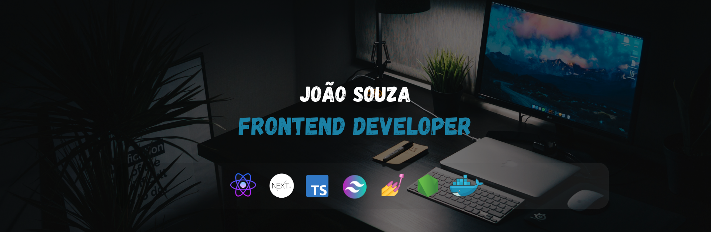

  

[![Email][gmail-shield]][gmail-url]
[![Linkedin][linkedin-shield]][linkedin-url]
[![WhatsApp][whatsapp-shield]][whatsapp-url]
[![Portfolio][portfolio-shield]][portfolio-url]

Olá, como vai?

Sou João Souza, JavaScript/TypeScript Developer 🚀. Apaixonado por tecnologia e tenho como foco principal a área de desenvolvimento Web. Em meu tempo livre, gosto de ler 📚 e brincar com meu pet 🐶

#### Um pouco sobre mim:

-   💻 Criando sempre novos projetos;
-   🌱 Estou sempre aprendendo mais sobre React e Next.js;
-   📕 Sempre que tenho dúvidas, pesquiso, anoto os principais pontos e pratico;
-   💬 Qualquer dúvida, sinta-se a vontade para entrar em contato, estou à disposição 😄;

## 🚀 Tech Stack

    
    
    
    
    
    
    
    
    
    
    
    
    
    
    
    

 

<!--LINKS E IMAGENS-->

[portfolio-shield]: https://img.shields.io/badge/-portfolio-302460?style=for-the-badge&logo=alwaysdata&logoColor=white
[portfolio-url]: https://portfolio-joaosouza7.vercel.app
[linkedin-shield]: https://img.shields.io/badge/LinkedIn-0077B5?style=for-the-badge&logo=linkedin&logoColor=white
[linkedin-url]: https://www.linkedin.com/in/joao-souza07
[gmail-shield]: https://img.shields.io/badge/Gmail-D14836?style=for-the-badge&logo=gmail&logoColor=white
[gmail-url]: mailto:joaoosouza07@gmail.com
[whatsapp-shield]: https://img.shields.io/badge/WhatsApp-25D366?style=for-the-badge&logo=whatsapp&logoColor=white
[whatsapp-url]: https://api.whatsapp.com/send?phone=5561999435633&text=
